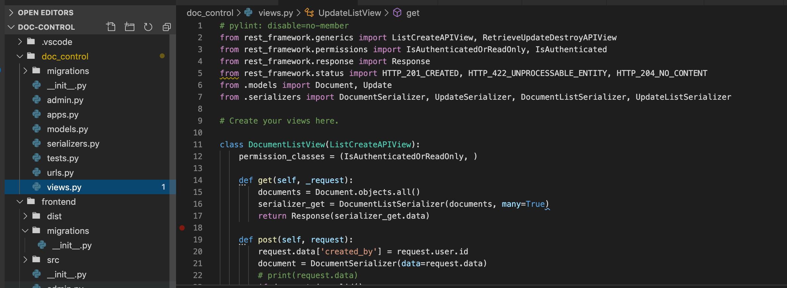

## DOC-control- Project 4
Our fourth project consisted of building any app with React and Django. Olly and I made a team to build a simpple document control system in one week. This was something we have not build in before so the documtation reading begun as soon we made the decision.

---

## The App
The idea came from the problems we have been facing when rebuilding a house. What was needed was a system that could sum up all the cahnges that were made while building and why. First we needed a place to store the drawings and then we needed way to link the drawings to the notes and updates to that specific drawing. The software should also be able to handle 

## Built With

1. React
2. NodeJS
3. Django
4. JWT token
5. Python
6. web-pack
7. PostgreSQL

## How it works

To get any data in or out a user have to register with password and email. After register the user is send to login to type in email and password. For upload a drawing choose create in the top menu. 
When a drawing is uploaded the time and name is loaded to the PostgreSQL together with the username. We can now add comments to the drawing or upload more drawings.

If the user choose to make a comment / update to a document the time, date and username will be put in the database. The latest update is shown beside the drawing when opening the libray. 

## Code and structure

Django is a framework for Python or for most of it I were using build in functions. The framework can use PostgreSQL and create data structure in a SQL database via the models. Then to make the API inteface to axios we programmed serializers and call them from views via url's.

 

Frontend is a bit different becouse the call is directly to the url's as we have no seializers.

Django have a function that sets up a file structure where for us when called. This makes it easy to use and very hard to navigate caused to the filenames are the same in each folder as shown below. 

 

## Challanges and learnings in this project.
I was doing the backend for the project and the learning curve was steap. 
The Django framework was made as pretty much self study. 
We spend some days trying to figurer out how to upload and store the drawings diretcly in the PostgreSQL database with a uniq number. This was not good use of time since Heroku does not allow this. We had to change to and use Cloudinary to store the files that then can be called with a URL. The only change I had to make in the backend was the field type in the model, but time spend does not come back. 
My learnings from this project is not only on the technical side with the Django framework and React but also a lot on the personal plan and not giving up even if the timelimit seems impossible.  

## Deployment
The local build is done with python and the NodeJs. I had to install some additional packages to create the build (psycopg2-binary and djnago-heroku).

Heroku hosting PostgreSQL is a bit different than other database types I have delt with. For starting the database build on Heroku I had to run commands on the  Heroku-server to migrate the database. 

## Author

Morten Elbo - https://github.com/mElbo-dk
